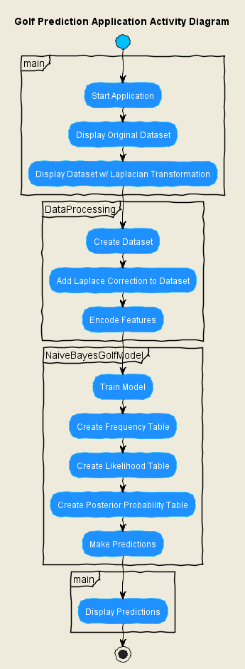

# Naive Bayes Golf Prediction

This repository contains a Python implementation of a Naive Bayes classifier for predicting whether or not one will play golf based on the weather outlook. The implementation uses the scikit-learn package and demonstrates the Laplacian correction technique for handling zero-probability problems.

## Problem Description

The dataset used in this project contains 14 observations and three features:

1. A sequential number representing the day each observation was recorded.
2. A categorical variable containing the weather outlook for that day (Rainy, Overcast, or Sunny).
3. A target variable indicating whether we played golf on that day (Yes or No).

The goal is to predict whether or not we will play golf on a given day based on the day's weather outlook.

## Implementation Details

The Python script performs the following steps:

1. Applies the Laplacian correction technique to handle zero-probability problems.
2. Converts the dataset into a frequency table.
3. Creates a likelihood table by finding relevant probabilities.
4. Calculates the posterior probabilities for each class.

The implementation uses the `CategoricalNB` model from the scikit-learn package to handle categorical feature variables.

## UML Diagrams

The following diagrams help illustrate the structure and flow of the application.

### Class Diagram


This diagram shows the classes used in the application and their relationships.

### Sequence Diagram


This diagram shows the sequence of interactions between different components in the application.

### Activity Diagram


This diagram visualizes the workflow logic captured by the application.

## Prerequisites

Make sure you have installed all of the following prerequisites on your development machine:

- Python 3.x - [Download & Install Python](https://www.python.org/downloads/)
- Pip - [Download & Install Pip](https://pip.pypa.io/en/stable/installing/)

## Installation

Clone the repository and navigate to the project folder. Run pip install to install necessary packages:

```bash
git clone https://github.com/sminerport/naive-bayes-golf-prediction.git
cd naive-bayes-golf-prediction
pip install -r requirements.txt
```

## Usage

To run the script, simply execute main.py using your Python interpreter. The script includes the sample dataset, so no additional data input is needed.

## Contributing

Feel free to fork this repository, make improvements, and submit pull requests. We welcome contributions that can help improve the code, write-up, or overall understanding of the Naive Bayes classifier and its application in this context.

## Future Improvements

We aim to improve this application by:

* Adding more datasets for testing and validation.
* Improving the Naive Bayes algorithm for better performance.

## License

This project is licensed under the [MIT License](LICENSE).
