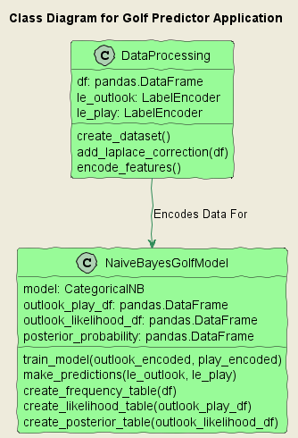
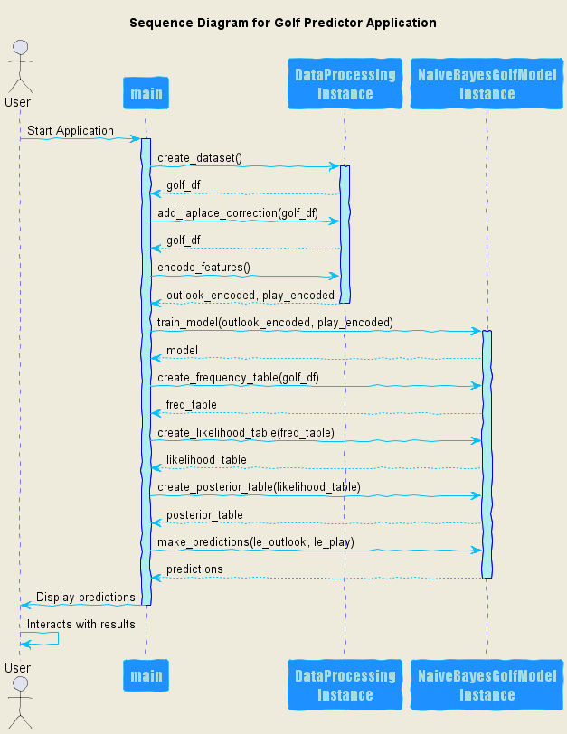
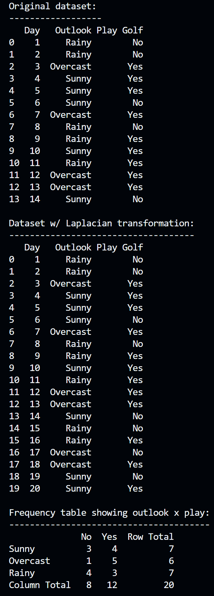
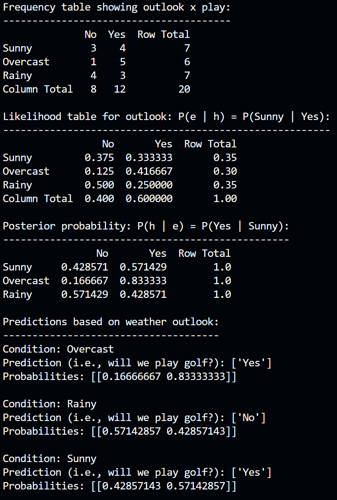

# Naive Bayes Golf Prediction

This repository contains a Python implementation of a Naive Bayes classifier for predicting whether or not one will play golf based on the weather outlook. The implementation uses the scikit-learn package and demonstrates the Laplacian correction technique for handling zero-probability problems.

## Problem Description

The dataset used in this project contains 14 observations and three features:

1. A sequential number representing the day each observation was recorded.
2. A categorical variable containing the weather outlook for that day (Rainy, Overcast, or Sunny).
3. A target variable indicating whether we played golf on that day (Yes or No).

The goal is to predict whether or not we will play golf on a given day based on the day's weather outlook.

## Implementation Details

The Python script performs the following steps:

1. **Applies the Laplacian correction:** This technique handles zero-probability problems by adding a small, non-zero value to the counts.

2. **Creates a Frequency Table:** The dataset is converted into a table that summarizes how often each weather condition leads to playing or not playing golf.

3. **Creates a Likelihood Table:** Using the frequency table, we calculate conditional probabilities of playing golf given a certain weather outlook. These probabilities, also known as likelihoods, are obtained by normalizing frequencies within each weather condition.

4. **Calculates Posterior Probabilities:** These are the probabilities of playing golf given the evidence (weather condition). We calculate this using Bayes' theorem, which considers both the likelihood and prior probabilities. The CategoricalNB model from the scikit-learn package then uses these posterior probabilities to make predictions.

The implementation uses the `CategoricalNB` model from the scikit-learn package to handle categorical feature variables.

## UML Diagrams

The following diagrams help illustrate the structure and flow of the application.

### Class Diagram


This diagram shows the classes used in the application and their relationships.

### Sequence Diagram


This diagram shows the sequence of interactions between different components in the application.

### Activity Diagram


This diagram visualizes the workflow logic captured by the application.

## Example Output

This section shows screenshots from a successful run of the program.



This screenshot shows the initial state of the dataset and the application of the Laplacian correction.



This screenshot shows the resulting frequency table, likelihood table, and the final predictions made by the application.

## Prerequisites

Make sure you have installed all of the following prerequisites on your development machine:

- Python 3.x - [Download & Install Python](https://www.python.org/downloads/)
- Pip - [Download & Install Pip](https://pip.pypa.io/en/stable/installing/)

## Installation

Clone the repository and navigate to the project folder. Run pip install to install necessary packages:

```bash
git clone https://github.com/sminerport/naive-bayes-golf-prediction.git
cd naive-bayes-golf-prediction
pip install -r requirements.txt
```

## Usage

To run the script, simply execute main.py using your Python interpreter. The script includes the sample dataset, so no additional data input is needed.

## Contributing

Feel free to fork this repository, make improvements, and submit pull requests. We welcome contributions that can help improve the code, write-up, or overall understanding of the Naive Bayes classifier and its application in this context.

## Future Improvements

We aim to improve this application by:

* Adding more datasets for testing and validation.
* Improving the Naive Bayes algorithm for better performance.

## License

This project is licensed under the [MIT License](LICENSE).
